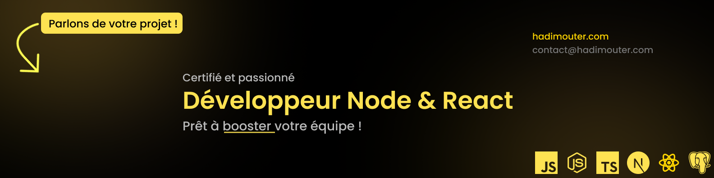

# Hadi Mouter - Full-Stack Developer

    | 📍 Paris | 🎯 Audit technique GRATUIT

## Je résous les problèmes techniques qui coûtent cher

Spécialisé dans les architectures SaaS complexes et les migrations critiques.
Mon obsession : un code qui scale et une équipe qui ship sereinement.

### Impact direct sur le business
- **-95%** d'erreurs → 200k€ économisés/an (migration système de gestion)
- **+16%** de CA → Automatisation complète des réservations
- **-60%** bugs production → Division par 3 du support technique

## Audit technique GRATUIT

**Je détecte vos problèmes cachés** (valeur 1200€)
- Analyse : Code, Architecture, Performance, Sécurité
- Livrable : Rapport PDF + Plan d'action prioritisé
- Engagement : Aucun, c'est cadeau

📅 **[Réserver votre audit gratuit](https://calendly.com/hadimouter/call-30min-gratuit)**

## Tech Stack

### Frontend

### Backend

### DevOps & Outils

### Testing & Design

## Derniers projets livrés

### SaaS Multi-tenant B2B
- Architecture pour 2000+ utilisateurs actifs
- Next.js App Router + Prisma + Row Level Security
- **Résultat:** Zero faille de sécurité, zero downtime

### Migration JavaScript → TypeScript
- 150k lignes migrées sans interruption de service
- Couverture de tests: 0% → 85%
- **Résultat:** Équipe 2x plus rapide, bugs divisés par 3

### Plateforme IA Éducative
- Intégration GPT-4 avec système de cache intelligent
- 10k requêtes/jour, latence < 200ms
- **Résultat:** 85% de rétention utilisateur

## Travaillons ensemble

**Je prends des missions où je peux avoir un vrai impact:**
- ✅ Développement SaaS from scratch
- ✅ Refonte d'architecture legacy
- ✅ Optimisation de performance critique
- ✅ Accompagnement technique d'équipe

**Ce que je ne fais pas:**
- ❌ Sites vitrines WordPress
- ❌ Missions de maintenance pure
- ❌ "Petites modifs" sur du code spaghetti

📧 contact@hadimouter.com | 📅 [Discutons de votre projet](https://calendly.com/hadimouter/call-30min-gratuit)

---
*"Un bon développeur résout des problèmes. Un excellent développeur évite qu'ils arrivent."*
